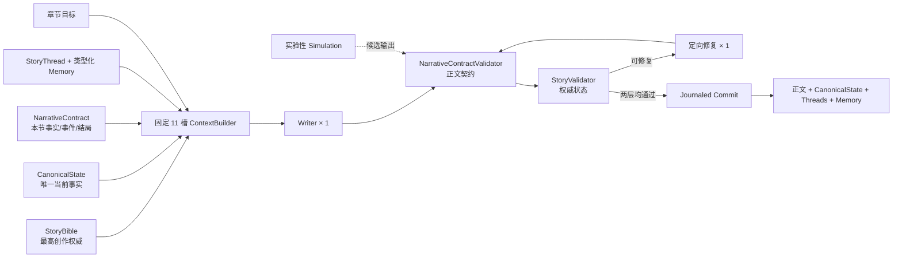

# 无限小说生成系统（Infinite Novel Generator）

一个以“长期记忆、主题稳定、背景一致”为目标的长篇小说生成系统。后端使用 FastAPI，前端使用 React/Vite。默认作者模式以 `StoryBible` 和 `CanonicalState` 为双重权威，由单一 Writer 围绕明确的章节目标生成候选稿，再经确定性 Validator 与可恢复事务提交；原有多 Agent 世界模拟保留为显式开启的实验模式。

> 权威顺序：**StoryBible（不可越界的创作契约）→ CanonicalState（唯一当前事实）→ 最终验证通过的 StateDelta → MemoryRepository → 旧迁移数据 / simulation 候选。** StoryThread 是受证据和生命周期约束的叙事导航仓库，不是第二套事实源。
>
> 发布基线为 **v2.49**。当前主分支在此基础上加入了长篇状态复验、风格契约、跨段编辑与风格验证工具，详见 [CHANGELOG.md](./CHANGELOG.md)。

## 核心能力

- 作者模式主链：正文 `NarrativeContract`、固定槽位上下文、单 Writer、正文/权威状态分层校验、至多一次定向修复与事务式落盘。
- 长篇连续性：创作圣经、唯一规范状态、类型化长期记忆、开放故事线、读者/角色知识边界与修订号并发控制。
- 可恢复持久化：临时文件 + `fsync` + 原子替换、last-good 备份、损坏隔离和提交日志重放。
- 可选世界模拟：九 Agent / 七阶段 Tick 仅在作品显式切换到 `simulation` 后延迟加载，其候选正文与状态变化仍经过同一个 Validator/Canonical 事务网关。
- 叙事质量控制：风格 preset、风格契约、确定性质量指标、LLM critic、段落接缝诊断和章节编辑。
- 多模型接入：内置 23 个 OpenAI 兼容 provider，也支持 one-api、Azure OpenAI、Ollama 等自定义端点。
- 阅读与多媒体：Narrative 分页、视点标记、全文搜索，以及分段、图片、TTS、字幕和视频生成链路。
- Web 应用能力：邮箱 OTP/JWT、多租户数据隔离、任务队列、SSE 状态推送和知识图谱可视化。

## 架构概览



`ContextBuilder` 使用十一个独立预算槽位：StoryBible、CanonicalState、NarrativeContract、章节目标、活动故事线、读者知识、角色知识、前文尾部、近期摘要、相关长期记忆和风格契约，并受 24,000 字符 / 12,000 估算 token 的全局硬预算约束。NarrativeContract 由 StoryBible、CanonicalState、SectionGoal、目标 StoryThread 和结构化用户约束确定性构建；不可变规则不会被静默截断。上下文清单只记录计数、全局占用、拒绝原因、引用 ID 与截断信息，不泄露 prompt 或候选正文。

作者模式核心数据写入作品自己的数据目录：

- `story_bible.json`：逐字原始 seed、字段来源、theme key、定位/参考、主题、设定规则、禁区、主冲突和 author 唯一风格契约。
- `canonical_state.json`：角色、物品、关系、知识边界、当前场景等唯一规范事实。
- `story_threads.json` / `memory_records.json`：故事线生命周期与有证据的类型化记忆。
- `generation_transactions/`：候选、校验报告和目标快照组成的恢复日志。
- `context_manifest.json` / `generation_mode.json`：上下文审计元数据与作品模式。

旧 `tick_state.json`、`fact_ledger.json`、`memory_store.json`、`summary_tree.json` 会被只读迁移；原文件保留，L3 传说只作为不确定历史记忆，不会直接升级为规范事实。完整设计见 [作者模式架构说明](./docs/author-mode-architecture.md)。

## 快速开始

### 环境要求

- Python 3.11+
- Node.js 18+
- npm
- 可用的 OpenAI 兼容 LLM API（默认配置为 DeepSeek）

### 1. 安装依赖

Windows PowerShell：

```powershell
Copy-Item .env.example .env
python -m venv .venv
.\.venv\Scripts\Activate.ps1
python -m pip install -r requirements-dev.txt

Push-Location frontend
npm install
Pop-Location
```

编辑 `.env`，至少填写所选 provider 的 API Key。不要把真实密钥写入 `config.json` 或提交到 Git。

### 2. 启动开发环境

终端一：

```powershell
python run.py --reload
```

终端二：

```powershell
Set-Location frontend
npm run dev
```

- 前端：http://127.0.0.1:3143/
- 后端：http://127.0.0.1:8762/
- 健康检查：http://127.0.0.1:8762/api/health
- OpenAPI：http://127.0.0.1:8762/docs

### 3. 在默认作者模式生成一节

```powershell
# 创建作品后，在 Web 的“章节创作”填写目标并生成；也可调用：
Invoke-RestMethod -Method Post `
  -Uri http://127.0.0.1:8762/api/novels/{novel_id}/sections/generate `
  -ContentType application/json `
  -Body '{"objective":"主角首次发现城中时间异常的可验证证据"}'
```

九 Agent Tick 世界模拟不再随作品加载自动启动。需要实验性模拟时，请在作品设置中显式切换模式，再调用 Tick API。

## LLM 配置

通过 `.env` 中的 `LLM_PROVIDER` 切换 provider。每个 provider 使用独立的 `*_API_KEY`、`*_BASE_URL` 和 `*_MODEL` 配置。

| 类别 | Provider |
| --- | --- |
| 国内 | `deepseek`、`mimo`、`qwen`、`zhipu`、`moonshot`、`baidu`、`ark`、`siliconflow`、`stepfun`、`minimax`、`baichuan`、`lingyiwanwu`、`ai360` |
| 海外 | `openai`、`xai`、`groq`、`openrouter`、`together`、`fireworks`、`mistral`、`novita`、`gemini_oai` |
| 自定义 | `custom`，适用于任意 OpenAI 兼容网关 |

完整示例和长篇质量开关见 [.env.example](./.env.example)。provider catalog 的权威定义位于 `core/config.py:_PROVIDER_CATALOG`。

## 常用 API

| Endpoint | 用途 |
| --- | --- |
| `GET /api/health` | 服务健康检查 |
| `GET/PUT /api/novels/{id}/story-bible` | 读取或按修订号更新最高创作契约 |
| `GET /api/novels/{id}/canonical-state` | 读取唯一当前事实源 |
| `GET /api/novels/{id}/story-threads` | 读取故事线生命周期与证据 |
| `GET/PUT /api/novels/{id}/generation-mode` | 读取或显式切换 author/simulation |
| `POST /api/novels/{id}/sections/generate` | 按章节目标异步生成、校验并提交 |
| `POST /api/novels/{id}/sections/contract-preview` | 查看不含正则/Prompt 的本节简化正文契约 |
| `GET /api/novels/{id}/sections/{task_or_section_id}/status` | 查询任务、事务与正式章节状态 |
| `GET /api/novels/{id}/context-manifest` | 查看不含正文/prompt 的上下文审计清单 |
| `GET /api/novels/{id}/long-run/status` | 查看契约通过、Repair、revision、token 与恢复聚合状态 |
| `GET /api/tick/status` | 当前 Tick 运行状态 |
| `POST /api/tick/run` | 推进一个 Tick |
| `POST /api/tick/inject-event` | 注入外部事件 |
| `GET /api/tick/narratives` | 分页读取正文与视点信息 |
| `GET /api/tick/narratives/search` | 跨正文全文搜索 |
| `GET /api/tick/critic-log` | 查看 critic 决策轨迹 |
| `POST /api/section/generate` | 仅 simulation/遗留章节管线可用 |
| `GET /api/presets` | 获取题材与风格 preset |

以运行时 `/docs` 中的 OpenAPI 定义为准。

## 测试与质量验证

```powershell
# 全部后端测试
python -m pytest backend/tests/ -v

# 单文件
python -m pytest backend/tests/test_orchestrator_p0.py -v

# 覆盖率
python -m pytest backend/tests/ --cov=backend --cov-report=term-missing

# 前端生产构建
Set-Location frontend
npm run test:author
npm run build
```

真实 OpenAI 兼容 provider 的作者链路冒烟（凭据只从环境变量读取）：

```powershell
python scripts/smoke_author_mode.py --desired-length 500
```

不调用 Provider 的权威/恢复十步录制式冒烟：

```powershell
python scripts/smoke_author_mode_recorded.py
```

录制式 smoke 只证明 seed、StateDelta、revision guard、恢复和长期记忆上下文，不证明文学质量。

风格与长程叙事验证：

```powershell
python scripts/validate_styles.py --help
python scripts/run_author_longrange.py --help
python scripts/analyze_author_longrange.py --help
python scripts/compare_author_longrange.py --help
python scripts/analyze_longrange_drift.py --help
python scripts/compare_bench.py --help
```

测试通过 `mock_llm` fixture 隔离真实 LLM；benchmark 和风格验收脚本才会按参数调用真实 provider。

## Windows Docker 部署与更新

首次部署请阅读 [deploy/docker/README.md](./deploy/docker/README.md)。Compose 栈包含后端和可选的 Cloudflare Tunnel，运行数据通过 bind mount 保存在项目根 `data/`，不会写入镜像。

本地代码已经是最新、只需要重新构建并部署现有 Docker 服务时，在项目根双击或执行：

```bat
update-docker.bat
```

脚本会检查 Docker Desktop、`.env`、`config.json` 和 Compose 配置，然后重建后端镜像、替换后端容器并等待健康；已有 Cloudflare Tunnel 不会被停止或重建。脚本不会执行 `git pull`、删除数据、清理镜像或修改配置。

常用参数：

```bat
update-docker.bat --all
update-docker.bat --check
update-docker.bat --help
```

`--all` 用于同时校准后端与 Cloudflare Tunnel 服务，需要 `.env` 已配置 `CLOUDFLARED_TOKEN`。`--backend-only` 是默认行为的显式写法；`--check` 只检查部署前提，不修改容器。

默认行为的手动等价命令：

```powershell
docker compose -f deploy/docker/docker-compose.yml --env-file .env up -d --build backend
```

## 生产安全

- `.env`、`config.json` 和运行数据均已从 Git 排除；生产环境必须设置稳定的 `JWT_SECRET`。
- 业务 API 已具备用户认证和数据隔离，但部分管理面 API 默认不鉴权。
- 公网部署应在反向代理或 Cloudflare Access 层增加访问控制，并收紧 `cors_origins`。
- Compose 默认只把后端绑定到 `127.0.0.1:8762`，不要在没有额外鉴权时直接暴露到公网。
- 更新或迁移前应备份项目根 `data/`；更新脚本本身不会触碰该目录。

## 项目导航

| 路径 | 内容 |
| --- | --- |
| `backend/agents/` | 多智能体实现 |
| `backend/story/` | 默认作者模式的权威模型、上下文、校验、事务、迁移和模拟网关 |
| `backend/nf_core/` | LLM、冲突解析、prompt 与多媒体核心 |
| `backend/api/` | FastAPI 路由 |
| `backend/memory/`、`memory_system/` | Tick 状态与数据契约 |
| `backend/novel_presets/` | 题材与风格 preset |
| `quality_metrics/` | 确定性质量指标 |
| `frontend/src/` | React 用户界面 |
| `scripts/` | benchmark、诊断与验收工具 |
| `deploy/` | Docker、systemd、Cloudflare 与前端部署说明 |
| `docs/design/` | 设计文档 |
| `docs/iter/` | 实验记录、runbook 与 benchmark 产物 |
| `old/` | 只读的 v1.x 章节式生成器归档 |

进一步阅读：

- [多智能体设计哲学](./docs/design/infinite-novel-multiagent-prompts.md)
- [迭代索引](./docs/iter/INDEX.md)
- [详细迭代日志](./docs/iter/ITERATION_LOG.md)
- [版本历史](./CHANGELOG.md)
