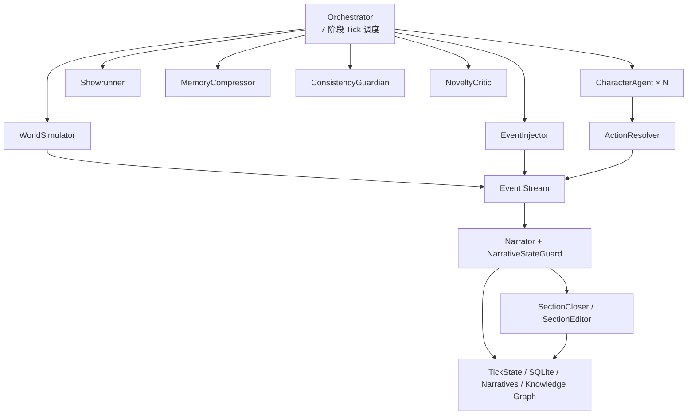

# 无限小说生成系统（Infinite Novel Generator）

一个以世界模拟为核心的多智能体长篇小说生成系统。后端使用 FastAPI，前端使用 React/Vite；角色、世界、事件和记忆先持续演化，Narrator 再从事件流中选择值得讲述的内容。

> 设计原则：**故事是模拟的副产品，Narrator 负责选择性讲述。**
>
> 发布基线为 **v2.49**。当前主分支在此基础上加入了长篇状态复验、风格契约、跨段编辑与风格验证工具，详见 [CHANGELOG.md](./CHANGELOG.md)。

## 核心能力

- 多智能体 Tick 调度：世界演化、事件注入、角色决策、行动冲突解析、叙事、节奏控制、记忆压缩和一致性检查协同运行。
- 长篇连续性：原子化状态持久化、事实账本、开放伏笔、知识图谱、分层摘要及叙事状态复验。
- 叙事质量控制：风格 preset、风格契约、确定性质量指标、LLM critic、段落接缝诊断和章节编辑。
- 多模型接入：内置 23 个 OpenAI 兼容 provider，也支持 one-api、Azure OpenAI、Ollama 等自定义端点。
- 阅读与多媒体：Narrative 分页、视点标记、全文搜索，以及分段、图片、TTS、字幕和视频生成链路。
- Web 应用能力：邮箱 OTP/JWT、多租户数据隔离、任务队列、SSE 状态推送和知识图谱可视化。

## 架构概览



| 组件 | 运行频率 | 作用 |
| --- | --- | --- |
| Orchestrator | 每 Tick | 协调阶段、收集诊断、同步知识图谱并持久化 |
| WorldSimulator | 每 Tick | 推进时间、环境和社会状态 |
| EventInjector | 每 3–5 Tick | 注入内生、外生或戏剧事件 |
| CharacterAgent × N | 每 Tick | 基于角色已知事实、目标和关系做决策 |
| ActionResolver | 每 Tick | 用确定性规则解决行动冲突并生成状态转移 |
| Narrator | 每 Tick | 选择材料并生成正文；低价值事件可保持沉默 |
| Showrunner | 每 5 Tick | 管理节奏、角色弧线和开放伏笔 |
| NoveltyCritic | 每 20 Tick | 检测重复表达和模式退化 |
| ConsistencyGuardian | 每 30 Tick | 扫描事实、时间线和角色一致性问题 |
| MemoryCompressor | 每 50 Tick | 执行 L0 → L1 → L2 → L3 分层压缩 |
| SectionCloser / Editor | 节边界 | 判定切节、消除跨段接缝并复验事实 |

核心数据默认写入 `backend/data/novels/{novel_id}/`：

- `tick_state.json`：世界、角色、伏笔、风格契约等当前状态。
- `ticks.db`：SQLite WAL 事件与 Tick 日志。
- `summary_tree.json`：分层摘要与长期记忆。
- `knowledge_graph.json`：实体与关系图。
- `narratives/`：逐 Tick 正文及视点 sidecar。

## 快速开始

### 环境要求

- Python 3.11+
- Node.js 18+
- npm
- 可用的 OpenAI 兼容 LLM API（默认配置为 DeepSeek）

### 1. 安装依赖

Windows PowerShell：

```powershell
Copy-Item .env.example .env
python -m venv .venv
.\.venv\Scripts\Activate.ps1
python -m pip install -r requirements-dev.txt

Push-Location frontend
npm install
Pop-Location
```

编辑 `.env`，至少填写所选 provider 的 API Key。不要把真实密钥写入 `config.json` 或提交到 Git。

### 2. 启动开发环境

终端一：

```powershell
python run.py --reload
```

终端二：

```powershell
Set-Location frontend
npm run dev
```

- 前端：http://127.0.0.1:3143/
- 后端：http://127.0.0.1:8762/
- 健康检查：http://127.0.0.1:8762/api/health
- OpenAPI：http://127.0.0.1:8762/docs

### 3. 冷启动世界并推进 Tick

```powershell
python -m backend.bootstrap_prompts --novel-id mountain --seed "一个被遗忘的山城正在缓慢苏醒"
Invoke-RestMethod -Method Post http://127.0.0.1:8762/api/tick/run
```

Narrator 在事件总价值不足时会主动沉默，这是预期行为。需要推进剧情时可通过前端或 `inject-event` API 注入事件。

## LLM 配置

通过 `.env` 中的 `LLM_PROVIDER` 切换 provider。每个 provider 使用独立的 `*_API_KEY`、`*_BASE_URL` 和 `*_MODEL` 配置。

| 类别 | Provider |
| --- | --- |
| 国内 | `deepseek`、`mimo`、`qwen`、`zhipu`、`moonshot`、`baidu`、`ark`、`siliconflow`、`stepfun`、`minimax`、`baichuan`、`lingyiwanwu`、`ai360` |
| 海外 | `openai`、`xai`、`groq`、`openrouter`、`together`、`fireworks`、`mistral`、`novita`、`gemini_oai` |
| 自定义 | `custom`，适用于任意 OpenAI 兼容网关 |

完整示例和长篇质量开关见 [.env.example](./.env.example)。provider catalog 的权威定义位于 `core/config.py:_PROVIDER_CATALOG`。

## 常用 API

| Endpoint | 用途 |
| --- | --- |
| `GET /api/health` | 服务健康检查 |
| `GET /api/tick/status` | 当前 Tick 运行状态 |
| `POST /api/tick/run` | 推进一个 Tick |
| `POST /api/tick/inject-event` | 注入外部事件 |
| `GET /api/tick/narratives` | 分页读取正文与视点信息 |
| `GET /api/tick/narratives/search` | 跨正文全文搜索 |
| `GET /api/tick/critic-log` | 查看 critic 决策轨迹 |
| `POST /api/section/generate` | 生成并收束一个节 |
| `GET /api/presets` | 获取题材与风格 preset |

以运行时 `/docs` 中的 OpenAPI 定义为准。

## 测试与质量验证

```powershell
# 全部后端测试
python -m pytest backend/tests/ -v

# 单文件
python -m pytest backend/tests/test_orchestrator_p0.py -v

# 覆盖率
python -m pytest backend/tests/ --cov=backend --cov-report=term-missing

# 前端生产构建
Set-Location frontend
npm run build
```

风格与长程叙事验证：

```powershell
python scripts/validate_styles.py --help
python scripts/analyze_longrange_drift.py --help
python scripts/compare_bench.py --help
```

测试通过 `mock_llm` fixture 隔离真实 LLM；benchmark 和风格验收脚本才会按参数调用真实 provider。

## Windows Docker 部署与更新

首次部署请阅读 [deploy/docker/README.md](./deploy/docker/README.md)。Compose 栈包含后端和可选的 Cloudflare Tunnel，运行数据通过 bind mount 保存在项目根 `data/`，不会写入镜像。

本地代码已经是最新、只需要重新构建并部署现有 Docker 服务时，在项目根双击或执行：

```bat
update-docker.bat
```

脚本会检查 Docker Desktop、`.env`、`config.json` 和 Compose 配置，然后重建后端镜像、替换后端容器并等待健康；已有 Cloudflare Tunnel 不会被停止或重建。脚本不会执行 `git pull`、删除数据、清理镜像或修改配置。

常用参数：

```bat
update-docker.bat --all
update-docker.bat --check
update-docker.bat --help
```

`--all` 用于同时校准后端与 Cloudflare Tunnel 服务，需要 `.env` 已配置 `CLOUDFLARED_TOKEN`。`--backend-only` 是默认行为的显式写法；`--check` 只检查部署前提，不修改容器。

默认行为的手动等价命令：

```powershell
docker compose -f deploy/docker/docker-compose.yml --env-file .env up -d --build backend
```

## 生产安全

- `.env`、`config.json` 和运行数据均已从 Git 排除；生产环境必须设置稳定的 `JWT_SECRET`。
- 业务 API 已具备用户认证和数据隔离，但部分管理面 API 默认不鉴权。
- 公网部署应在反向代理或 Cloudflare Access 层增加访问控制，并收紧 `cors_origins`。
- Compose 默认只把后端绑定到 `127.0.0.1:8762`，不要在没有额外鉴权时直接暴露到公网。
- 更新或迁移前应备份项目根 `data/`；更新脚本本身不会触碰该目录。

## 项目导航

| 路径 | 内容 |
| --- | --- |
| `backend/agents/` | 多智能体实现 |
| `backend/nf_core/` | LLM、冲突解析、prompt 与多媒体核心 |
| `backend/api/` | FastAPI 路由 |
| `backend/memory/`、`memory_system/` | Tick 状态与数据契约 |
| `backend/novel_presets/` | 题材与风格 preset |
| `quality_metrics/` | 确定性质量指标 |
| `frontend/src/` | React 用户界面 |
| `scripts/` | benchmark、诊断与验收工具 |
| `deploy/` | Docker、systemd、Cloudflare 与前端部署说明 |
| `docs/design/` | 设计文档 |
| `docs/iter/` | 实验记录、runbook 与 benchmark 产物 |
| `old/` | 只读的 v1.x 章节式生成器归档 |

进一步阅读：

- [多智能体设计哲学](./docs/design/infinite-novel-multiagent-prompts.md)
- [迭代索引](./docs/iter/INDEX.md)
- [详细迭代日志](./docs/iter/ITERATION_LOG.md)
- [版本历史](./CHANGELOG.md)
