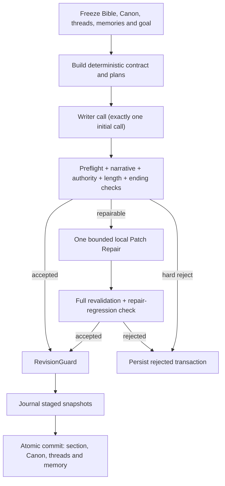

# Final Author architecture

## Authority and execution

| Order | Authority | Role |
| ---: | --- | --- |
| 1 | `NarrativeContract` | Per-section entities, facts, events, outcomes and prohibitions |
| 2 | `StoryBible` / `CanonicalState` | Immutable creative rules and the only current facts |
| 3 | `StoryThreadRepository` | Evidence-bound narrative obligations and liveness |
| 4 | `MemoryRepository` | Revision-aware background recall; never Canon |
| 5 | Style contract | Expression only; cannot change facts, events or length gates |

`ContextBuilder` freezes eleven budgeted slots and writes a `ContextManifest`.
The manifest contains source revisions, contract/execution hashes, selected and
discarded memory IDs with reasons, active thread IDs, slot budgets, global
utilization and truncation status.

The server deterministically builds `EventExecutionPlan`,
`SectionWritingPlan`, `SectionBudgetPlan` and `ChapterPlan`. The ChapterPlan
Validator remains mandatory, but its default provider-call count is zero.

## Transaction sequence

Repair never has state authority. Provider output is a local prose patch;
server-side code validates anchors, scope, event/end-state targets, forbidden
additions, length bounds and preserved spans. Any accepted patch then traverses
all original Validators again. A narrow safety normalization may remove an
unauthorized approximate particle count from an expansion; the original patch
remains persisted and the removal is explicitly audited.

## Recovery and exports

Transactions in `validated` or `committing` phases are recoverable from their
journal. Recovery is idempotent and rechecks frozen revisions; a stale Bible or
Canonical revision cannot be committed. Exports use public allowlists:

- manuscript export includes only committed sections;
- evidence export includes hashes, revisions and public receipts, not provider
  credentials, raw provider payloads or rejected prose;
- rejected/staged candidates remain visible in the evidence ledger but never
  appear in the official manuscript.

The default Author architecture is independent of the archived chapter
generator and does not reintroduce `core.NovelGenerator`.
