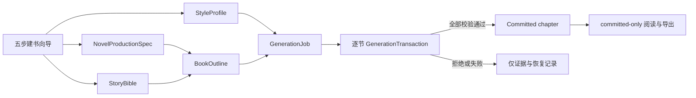
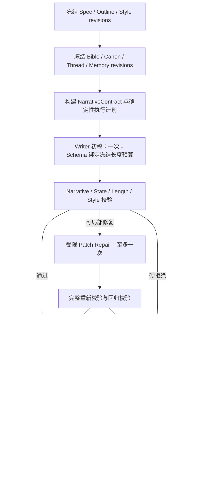

# 最终产品架构

本文描述当前产品架构，不记录某次验收的 PASS/FAIL。最终发布结论只能来自当前源码对应的
全新 evidence 周期，判定方法见 [最终验收](./FINAL_ACCEPTANCE.md)。

## 产品边界

默认产品路径是整书 Author production：用户先建立整书规格、整书大纲和风格档案，再由
持久化生产任务逐章、逐节生成正式稿。九 Agent / 七阶段 Tick 世界模拟是显式选择的
实验功能，不参与默认建书、大纲生成或整书生产，也不能绕过 Author 的校验与提交边界。

## 权威顺序

后位对象只能补充上下文，不能覆盖前位对象：

| 顺序 | 权威对象 | 职责 |
| ---: | --- | --- |
| 1 | `NarrativeContract` | 冻结本节必须事件、必需终态、禁止新增和长度范围 |
| 2 | `StoryBible` | 全书创作契约、人物和不可越界设定 |
| 3 | `CanonicalState` | 唯一当前事实源 |
| 4 | `StoryThreadRepository` | 有证据的叙事义务、推进和存活状态 |
| 5 | `MemoryRepository` | revision-aware 检索；不能把回忆直接提升为事实 |
| 6 | `StyleProfile` | 只控制表达，不得改变事实、事件、终态、长度或故事线状态 |

整书 `ProductionSpec` 与 `BookOutline` 位于每节契约的上游：它们决定全书尺度、章节顺序
和章节目标，但不能倒写已经提交的 Canon 或章节。Provider 输出没有任何直接写权；只有
服务端 Validator 和 RevisionGuard 通过后，事务才能提交。

## 整书领域对象

| 对象 | 持久化位置 | 关键约束 |
| --- | --- | --- |
| `NovelProductionSpec` | `production_spec.json` | 总字数、卷章数、章/节目标、语言、结局方向；revision 更新 |
| `BookOutline` | `book_outline.json` | 卷章连续编号、卷归属、字符预算闭合、章节目标与进度分离 |
| `StyleProfile[]` | `style_profiles.json` | 内置 preset 只读；用户档案版本化；表达契约有稳定 hash |
| `ActiveStyleBinding` | `active_style.json` | 指向下一未开始章节使用的风格版本 |
| `ProductionMigrationReport` | `production_migration.json` | 幂等迁移状态、创建/保留文件和活动风格收据 |
| `GenerationJob` | `generation_jobs/{job_id}.json` | 单作品唯一活动任务、进度、冻结 revision、租约与终态 |
| `ProductionSectionAttempt` | `production_attempts/{attempt_id}.json` | 每次分节尝试；重试不覆盖旧失败证据 |
| `ProductionEventLog` | `production_events/{job_id}.json` | 单调 sequence 的可重放事件流 |
| `ProductionChapterRecord` | `production_chapters/{chapter_id}.json` | 章节工作/提交记录；只有完整 committed 章节可公开阅读 |

下层 Author 权威继续保存在 `story_bible.json`、`canonical_state.json`、
`story_threads.json`、`memory_records.json`、`generation_mode.json`、
`context_manifest.json`、`generation_transactions/` 与正式 section 存储
`tick_sections.jsonl` 中。所有正式长度统一为正文的非空白字符数。

## 建书与大纲

五步向导依次收集故事、篇幅、风格、Provider 和最终确认。确认后创建 Author 作品及其
整书对象。完整用户流程见 [长篇生产手册](./LONG_NOVEL_PRODUCTION.md)。

大纲生成最多使用一次结构化初始调用；首个结构无效时最多允许一次结构化修复。服务端
随后验证 schema、卷章连续性、卷归属、章节状态、总字符预算和 `ProductionSpec` 交叉
约束。章节生产期间不再调用大纲 Planner；提交过的章节目标和进度字段不能由用户编辑或
Provider 静默改写。

## 正文事务

每个章节按 outline 顺序处理，每个章节内的 section 严格串行：

默认生产循环不调用 LLM Planner，不执行全文 Writer retry。Repair 只有局部 prose patch
权限；anchor 不存在、修复越界、revision 漂移或任一完整重验失败时都拒绝候选。
`StyleProfile`、prompt hash、章节目标与所有权威 revision 会冻结在 Job、chapter 和
transaction 证据中。

Writer 的 Provider-only 输出是 `narrative_cells` 中 52 个显式非空白 prose cells：原十个
逻辑块仍按 opening 2 块、development 3 块、conflict 3 块、resolution 2 块组织；十块
依次含 `[4,4,6,6,6,6,6,6,4,4]` cells。全部 52 个值都是精确非空白字符串，每个值
承载一个完整展开的句级 prose beat，不接受嵌套对象或数组。标准 900–1100 section 只有
一个 1090 字 Provider 写作目标并保留 10 字硬上限余量：前两个 cells 各使用 20 字软目标，
其余 50 个 cells 各使用 21 字软目标，52 个实际 prose cell 目标相加恰好为 1090；十个
逻辑块只保留结构归属、不另设数值配额。服务端按
`o1u1 … r2u4` 固定键序直接拼接、块间加入段落分隔，
只有聚合后的 900–1100 个非空白字符是长度硬边界。持久化模型仍是原有
`WriterCandidate.narrative_text`，不会增加 Agent 或调用，也不会补字、截断或改写。
本地验收硬校验精确 52-key 形状、非空值和连接后总量，不伪造 per-cell 长度或句数约束；
同时只把十块/52 cells 的长度与句界计数写入 metadata-only receipt，便于无正文取证。
首个响应若仅序列化失败，格式修复继续使用同一动态 52-key 纯字符串 schema；修复结果再次执行冻结连接
与聚合长度契约，绝不降级为旧 `narrative_text` wire 形状。Primary/recovery 的旧 envelope、
错误 shape，以及格式修复后的聚合越界都会 fail-closed，不能提交。

大段长度修复可在同一次 Repair 响应中返回多个冻结 ID、anchor 和 placement 的微补丁。
每个 wire patch 的 `patch_text` 是三个必填 beat 对象值，服务端按固定顺序无损拼成既有内部
字符串。每个拼接后 patch 受硬最小/最大值及 authority/safety 约束，cell/patch 目标仅作
软引导；所有 patch 原子验证、原子应用，服务端不复制、补齐、截断或重新分配 Provider 正文。
补文块数由目标补量决定；服务端把真实缺口平衡分配成逐块最小值，并把最终剩余空间平衡分配
成逐块最大值。因此逐块合法集合在算术上既覆盖整节下限，也不可能把最终正文推过硬上限。

## Job 状态与控制

主要状态为 `queued`、`running`、`pausing`、`paused`、`failed`、`cancelling`、
`cancelled` 和 `completed`。

- 同一作品只能有一个活动 Job；`start` 对相同活动任务幂等返回。
- `pause` 在当前安全边界完成后生效，不撕裂原子提交，也不启动下一节。
- `resume` 重新检查冻结 revision 后再调度；陈旧上下文 fail closed。
- `cancel` 在安全边界停止，保留已经提交的章节。
- `retry-failed` 创建新的 attempt/transaction，并保留旧失败收据。
- Provider 认证或输出错误会使任务停在可恢复边界；Provider 401 不会清除应用 JWT。
- 限流或临时 5xx 只允许运行时定义的有限新 transaction 重试与退避，不复用半成品。

控制、状态、SSE 和章节 DTO 见 [API 参考](./API.md)。

## 持久化与恢复

关键 JSON 写入使用同目录临时文件、flush、`fsync` 和原子替换；权威文件保留 last-good
备份。无法解析或校验的文件先隔离，再 fail closed，不能用默认内容覆盖损坏证据。

服务启动时会扫描持久化 Job、attempt 和 transaction journal。`validated` 或
`committing` transaction 可在 RevisionGuard 仍成立时幂等恢复；恢复不得重复 section
ID、transaction ID、Canon revision、Thread 推进或 Memory 写入。恢复时缺少有效
Provider 配置不会提交半成品，任务保持可诊断、可恢复状态。

迁移、备份和版本回滚规则见 [迁移与回滚](./FINAL_MIGRATION_ROLLBACK.md)。

## Provider 边界

Provider 配置在每次调用时解析，优先级固定为：请求显式配置 → Stage 显式配置 → 服务端
持久配置 → 环境 fallback。浏览器可以只保存在会话或设备；浏览器没有完整配置时不会发送
残缺的用户 LLM headers，而由服务端 fallback 统一解析。真实验收只通过显式只读
`--provider-file` 使用原始 `coding.txt`。

Provider runtime、缓存隔离、reload、错误映射和秘密处理详见
[Provider 生命周期](./PROVIDER_RUNTIME_LIFECYCLE.md)。

## 阅读、证据与安全

章节列表只返回 `committed` 章节且省略正文；章节详情返回已提交正文及其 transaction、
Bible/Canon revision、修复和风格收据。manuscript 导出只包含已提交 section；evidence
导出只包含 allowlist 中的 revision、hash、公开 transaction 摘要、Thread/Memory 摘要
和提交元数据。

下列内容不得出现在 API 诊断、日志、报告、导出或 Git 中：完整 API key、Authorization、
完整 Provider Base URL、浏览器请求头、Provider 原始响应、Writer prompt、拒绝正文和
用户样文原句。

## 代码映射

| 层 | 主要路径 |
| --- | --- |
| 整书契约 | `backend/story/production_models.py` |
| 持久化与迁移 | `backend/story/production_persistence.py` |
| 领域服务 | `backend/story/production_service.py` |
| 后台调度与启动恢复 | `backend/story/production_runtime.py` |
| 单节 Author 适配 | `backend/story/production_adapter.py` |
| 大纲生成 | `backend/story/outline_generator.py` |
| 整书 CRUD / 风格 API | `backend/api/production_routes.py` |
| Job / SSE / chapter API | `backend/api/production_control_routes.py` |
| Author 权威与导出 API | `backend/api/story_routes.py` |
| Provider runtime | `backend/nf_core/provider_runtime.py`、`backend/nf_core/llm_client.py` |

自定义风格的独立契约见 [自定义风格档案](./CUSTOM_STYLE_PROFILES.md)。
