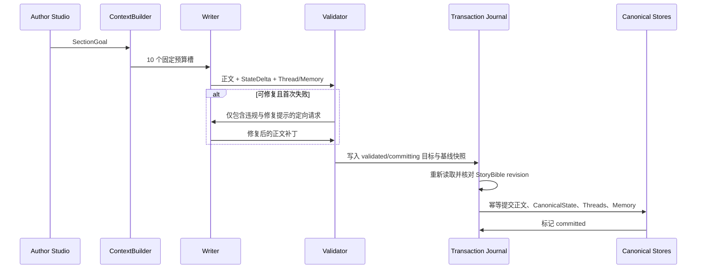

# 默认作者模式架构

## 目标与边界

默认运行路径围绕长期记忆、主题稳定和背景一致性设计。它不是旧 v1.x 单体章节生成器的回归，也不把九 Agent 模拟删除；它把“谁有权定义事实、哪些上下文可以进入 Writer、何时允许落盘”收束为一条可验证的主链。

作品首次打开时使用 `author` 模式，且不会导入或实例化 `TickRuntime`。只有用户显式切换为 `simulation` 时才延迟创建模拟运行时。模拟产生的正文和状态候选同样进入统一校验与事务网关，不能直接改写作者权威状态。

## 权威层级

1. `StoryBible` 是最高创作契约：用户原始 seed、主题 preset key、定位、参考偏好、故事前提、世界不可变规则、禁区、主角契约、主冲突、结局方向和风格契约。每个引导字段记录 `user_input`、`preset_derived`、`llm_inferred` 或 `legacy_inferred` 来源。
2. `CanonicalState` 是唯一当前可变事实：时间、角色、位置、物品、关系、读者/角色知识、情节位置和最近场景。
3. `StoryThread` 管理谜团、冲突、承诺、威胁和目标的生命周期；推进或解决必须附带正文证据。
4. `MemoryRecord` 用于检索历史，不覆盖 CanonicalState。每条记忆都有类型、规范状态、实体、来源引用、证据、重要度和创建修订号。
5. 知识图谱、旧事实账本、摘要树和模拟状态均为派生或迁移来源，不拥有最终写权。

StoryBible 的 PUT 使用 `expected_revision` 乐观并发控制；保存后标记为用户确认。新 author 作品在启动任何 bootstrap LLM 任务之前同步持久化原始输入，因此 bootstrap 失败不会丢失 seed，重试也不能覆盖已经确认的输入。旧作品只能从旧文件中的显式 seed 字段推断并标记 `legacy_inferred`；迁移器不读取 `bootstrap.env` 猜 seed。

Author 风格只有一个权威来源：`StoryBible.style_contract`。preset key、version、prompt hash、positioning 和 references 一并提升 Bible revision。旧 TickState style preset/anchors 只属于 simulation 运行数据，不能反向覆盖 StoryBible。

## 生成与提交主链

每次生成默认一次 Writer 调用，校验失败时最多追加一次修复调用。修复模型只能改变正文，结构化 StateDelta 和故事线提案保持原候选不变；修复后使用新正文重新校验每一条原始 StateDelta 的原 evidence，而不是信任第一次报告。第二次仍失败则事务进入 `rejected`，不产生正式章节或权威状态变化。

正式写入前会在 StoryBible 文件锁内重新读取 revision。若与事务记录不一致，事务进入 `stale_context` 并写入 `STORY_BIBLE_REVISION_STALE`；正文、CanonicalState、Threads 和 Memory 均不提交。恢复 `validated/committing` journal 时执行同一检查，已经发生的目标快照写入只有在仍精确等于该事务目标时才会回滚到基线，避免覆盖后续合法 revision。

十个上下文槽有独立字符预算：

1. `story_bible`（受保护，不因总预算丢失）
2. `canonical_state`
3. `section_goal`
4. `active_story_threads`
5. `reader_knowledge`
6. `character_knowledge`
7. `previous_prose_tail`（保留尾部）
8. `recent_section_summaries`
9. `relevant_long_term_memories`
10. `style_contract`

除槽位预算外，ContextBuilder 还执行 `MAX_CONTEXT_CHARS=24000` 和 `MAX_CONTEXT_TOKEN_ESTIMATE=12000` 全局硬预算。StoryBible、CanonicalState 和 SectionGoal 必须保留；可选槽按确定顺序收缩。不可变规则先去重，规则总数、单条长度、其他 Bible 列表项数和自由文本长度均有确定上限；规则绝不借助 LLM 摘要或静默截断，无法安全收缩时拒绝生成。

`context_manifest.json` 只记录各槽字符数、token 估算、全局上限、占用率、拒绝原因、是否截断、引用 ID、选择/省略数量和重复率；API 不返回 prompt、候选正文或事务目标快照。

## 确定性校验

Validator 在任何权威写入前检查：

- StoryBible 越界、禁区和主题偏离；
- 不存在的角色、死亡角色复活及世界规则中的禁止复活；
- StateDelta evidence 非空且可在正文定位，路径与目标类型兼容；每条 operation 独立判定，违规项不会混入 `validated_delta`；
- 位置跳跃、物品归属与转移；
- 角色知识来源、读者已知信息的重复揭示；
- 故事线重复开启、未知/已关闭线程推进、推进证据、解决要求和来源字段覆盖；推进采用有限字段合并，解决后保留原 description、origin refs 和 opened revision；
- StateDelta 路径和操作合法性。

模拟模式的类型化投影必须先从正文提取可定位证据；找不到证据的 operation 同样被逐项排除。simulation 只能绕过其可信投影已经表达的位置移动措辞检查，不能绕过 Bible、身份、证据、路径和类型检查。

## 持久化、恢复与迁移

作者域文件位于每部作品的既有数据目录：

| 文件 | 含义 |
| --- | --- |
| `story_bible.json` | 最高创作契约 |
| `canonical_state.json` | 唯一当前事实 |
| `story_threads.json` | 故事线仓库 |
| `memory_records.json` | 类型化长期记忆 |
| `generation_mode.json` | per-novel 模式和修订号 |
| `context_manifest.json` | 最近一次内容无关的上下文清单 |
| `generation_transactions/{id}.json` | 生成和提交 journal |
| `story_migration.json` | 迁移结果与警告 |

单文件保存使用同目录临时文件、flush、`fsync` 和 `os.replace`，覆盖前验证现有文件并保留 `.bak`。损坏文件复制到 `quarantine/`；无法验证时拒绝覆盖。事务先记录完整目标快照，再以可重复操作依次提交 CanonicalState、Threads、Memory 和正式章节，最后标记 `committed`。进程在中途退出时，下一次服务启动会重放 `validated/committing` 事务；章节用事务 ID 幂等追加，因此不会重复发布。

迁移器只读取旧 `tick_state.json`、`fact_ledger.json`、`memory_store.json` 和 `summary_tree.json`，不改写原文件。L3 传说只能成为 `uncertain` 历史记忆，不能成为 CanonicalState。占位 Bible/State 可被 bootstrap 丰富；任何用户确认的数据优先且不会被后续迁移覆盖。

## API 与运行模式

所有作者 API 需要当前用户身份并通过 `(user_id, novel_id, real data_dir)` 隔离：

- `GET/PUT /api/novels/{novel_id}/story-bible`
- `GET /api/novels/{novel_id}/canonical-state`
- `GET /api/novels/{novel_id}/story-threads`
- `GET/PUT /api/novels/{novel_id}/generation-mode`
- `POST /api/novels/{novel_id}/sections/generate`
- `GET /api/novels/{novel_id}/sections/{task_or_section_id}/status`
- `GET /api/novels/{novel_id}/context-manifest`

模式切换失败会回滚原 `generation_mode.json` 并清除不完整 runtime。作者模式中的 Tick、Agent 及旧 `/api/section/generate` 不会隐式创建模拟器，而是返回模式错误。删除作品前同时释放作者与模拟 runtime，避免 Windows 文件句柄阻止删除。

默认值可用 `GENERATION_MODE=author` 配置，但一旦作品生成了 `generation_mode.json`，以作品内配置为准。

## 运维与回滚

- 回滚单次生成：未提交或被拒绝的事务不影响正式章节；检查对应 journal 的 `validation_report`。
- 崩溃恢复：重新启动服务并加载该作品，服务会重放待提交事务。
- 数据损坏：先查看 `quarantine/` 和同名 `.bak`，不要直接覆盖损坏权威文件。
- 回到模拟实验：通过 generation-mode API 或前端显式切换；若初始化失败，模式自动回滚。
- 回到作者模式：切换后模拟 runtime 缓存立即释放，后续页面不轮询 Tick。

实现入口位于 `backend/story/`，HTTP 边界位于 `backend/api/story_routes.py`，模拟发布边界位于 `backend/story/simulation_gateway.py`。
